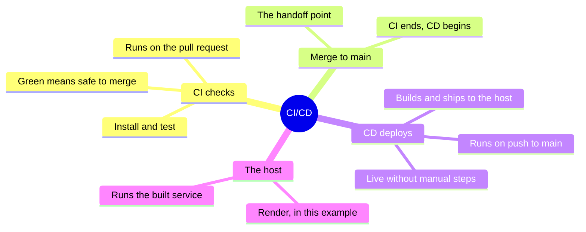
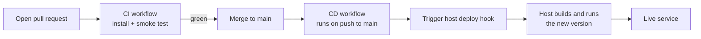
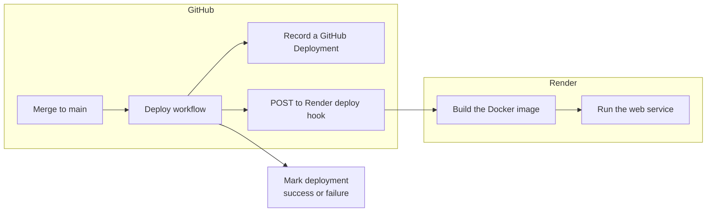

# Continuous Deployment (CD)

Continuous deployment (CD) is the other half of "CI/CD". Where continuous integration (CI) checks a change before it is allowed in, continuous deployment takes the change that just merged and gets it running in the live environment automatically, with no manual copy-to-server step. CI answers "is this change safe?"; CD answers "now put it where people can use it."

This kit uses a real, working pipeline as its example: an MCP server that deploys to Render, driven by a GitHub Actions workflow. Every idea below points at something that actually runs in that repository.

## CI and CD as one pipeline

The pipeline is a single conveyor belt. A change rides CI while it is a proposal, crosses into CD the moment it merges, and ends up live.

## Where Render fits

Render is a cloud host that runs the service. It is the destination of the deployment, not the thing that decides when to deploy. In this pipeline the decision to deploy is owned by a GitHub Actions workflow, which calls a Render deploy hook (a secret URL that tells Render "build and release now"). This is a deliberate design choice: auto-deploy is turned off inside Render so that every deployment is a single tracked event, triggered from one place.

## Pages in this kit

| Page | Purpose |
| --- | --- |
| [CD explained with a real pipeline]({{ site.baseurl }}/continuous-deployment/pipeline/) | The full CI-to-CD flow using the kenya-schools-mcp repository: the two workflows, the Render blueprint, deploy hooks, secrets, and why deployments are recorded as tracked events |
