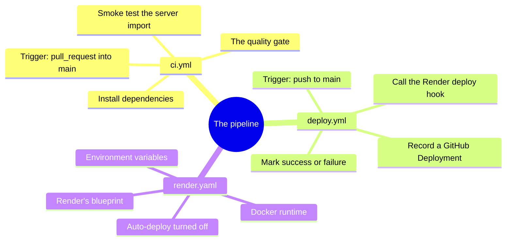
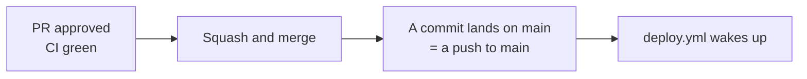
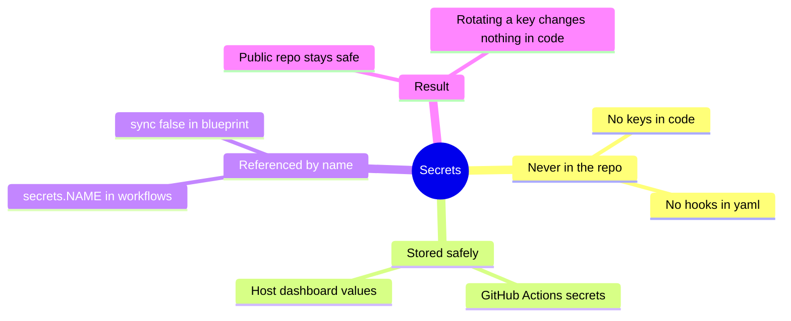
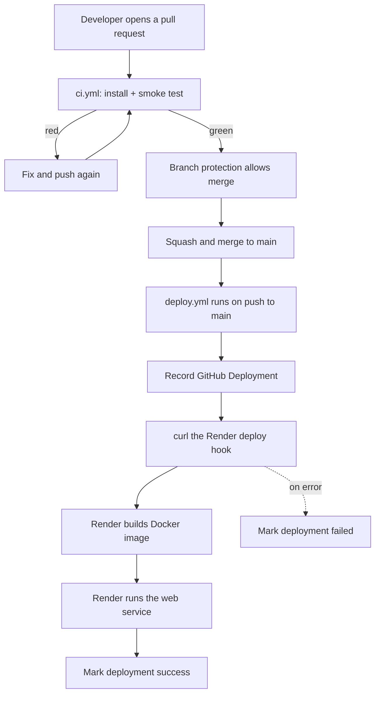

# CD explained with a real pipeline

This page walks through a complete continuous-deployment setup as it exists in a working repository: an MCP server (a curated directory of international schools in Kenya) that runs on Render. The repository has two workflows and one blueprint file, and together they form the full path from a proposed change to a live update.

## The three files that make it work



| File | Trigger | Role |
| --- | --- | --- |
| `ci.yml` | On every pull request into `main` | The CI gate: proves the change installs and the server imports before merge |
| `deploy.yml` | On every push (merge) to `main` | The CD driver: records the deployment and tells Render to release |
| `render.yaml` | Read by Render when the service is created | The blueprint: describes how Render should build and run the service |

## Step 1: CI checks the pull request

The CI workflow runs while a change is still a proposal. It installs the dependencies and runs a smoke test: it imports the server module and confirms it loads. If that fails, the pull request cannot go green, and branch protection keeps it out of `main`.

```yaml
name: CI

on:
  pull_request:
    branches: [main]

jobs:
  test:
    name: Build and smoke test
    runs-on: ubuntu-latest
    steps:
      - name: Checkout
        uses: actions/checkout@v4
      - name: Set up Python
        uses: actions/setup-python@v5
        with:
          python-version: "3.12"
          cache: pip
      - name: Install dependencies
        run: |
          python -m pip install --upgrade pip
          pip install -r requirements.txt
      - name: Smoke test (import the server)
        run: python -c "import server; print('server import OK')"
```

A smoke test is a deliberately small check: not "is every feature correct?" but "does the thing start at all?". It is cheap and catches the most common breakage, a change that does not even import.

## Step 2: merge is the handoff from CI to CD

When the pull request merges, its commit lands on `main`. That single event is the boundary. CI has finished its job; the merge is a push to `main`, and that push is exactly what the deploy workflow listens for.



## Step 3: CD deploys, and records the deployment

The deploy workflow runs on every push to `main`. It does more than "call Render"; it wraps the deployment in a recorded GitHub Deployment object so the event is tracked, then triggers Render, then marks the result. Recording the event is what lets delivery metrics (how often deployments happen, how often they fail) be measured later.

```yaml
name: Deploy

on:
  push:
    branches: [main]
  workflow_dispatch:

permissions:
  contents: read
  deployments: write

jobs:
  deploy:
    name: Deploy to Render
    runs-on: ubuntu-latest
    environment: production
    steps:
      - name: Checkout
        uses: actions/checkout@v4
      - name: Set up Python
        uses: actions/setup-python@v5
        with:
          python-version: "3.12"
          cache: pip
      # Record the deployment first, so a later failure is still tracked.
      - name: Create GitHub deployment
        id: deployment
        env:
          GH_TOKEN: ${{ github.token }}
        run: |
          # ... creates a Deployment object and saves its id ...
      - name: Install dependencies
        run: |
          python -m pip install --upgrade pip
          pip install -r requirements.txt
      - name: Smoke test (import the server)
        run: python -c "import server; print('server import OK')"
      - name: Trigger Render deploy
        env:
          HOOK: ${{ secrets.RENDER_DEPLOY_HOOK_URL }}
        run: curl -fsS -X POST "$HOOK"
      - name: Mark deployment successful
        if: success()
        # ... posts state=success to the deployment ...
      - name: Mark deployment failed
        if: failure() && steps.deployment.outputs.id != ''
        # ... posts state=failure to the deployment ...
```

The order is intentional: the deployment record is created before anything can fail, so that a broken build still leaves a "failed deployment" behind rather than disappearing silently. This is what makes the change-failure signal honest.

## Step 4: Render builds and runs the service

The single line that actually launches the deployment is `curl -X POST "$HOOK"`. That HOOK is a Render deploy hook: a private URL that means "pull the latest main and release it". When it fires, Render reads its blueprint and does the rest.

```yaml
services:
  - type: web
    name: kenya-schools-mcp
    runtime: docker
    dockerfilePath: ./Dockerfile
    plan: free
    autoDeploy: false
    envVars:
      - key: MCP_TRANSPORT
        value: http
      - key: HOST
        value: "0.0.0.0"
      - key: MCP_STATELESS
        value: "true"
      - key: LOCATIONIQ_KEY
        sync: false
```

Two details in this blueprint teach a wider lesson:

| Setting | What it does | Why it matters |
| --- | --- | --- |
| `autoDeploy: false` | Render will not deploy on its own when main changes | Deployment is driven only by the workflow, so every release is one tracked event, not two |
| `sync: false` on `LOCATIONIQ_KEY` | The value is not stored in the file | Secrets live in the host's dashboard, never committed to the repository |

## Secrets: the safe way to hold a deploy hook

The deploy hook and any API keys are credentials. They are never written into a file in the repository. Instead they are stored as secrets and referenced by name, `${{ secrets.RENDER_DEPLOY_HOOK_URL }}` in the workflow, or `sync: false` in the blueprint so Render prompts for the value in its own dashboard.



## Why record deployments at all

The deploy workflow could have been three lines: check out, curl the hook, done. It is longer on purpose, because it records each deployment as a tracked event with a success or failure status. That record turns delivery into something measurable: how often deployments happen, and how often they fail. Those are two of the widely used DORA delivery metrics, and they are only possible because each deployment leaves a trace instead of being an untracked side effect of a merge.

| Signal | Where it comes from in this pipeline |
| --- | --- |
| Deployment frequency | One deploy workflow run per merge to `main` |
| Change failure rate | The share of deployment records marked `failure` |
| Lead time for changes | The clock from a commit to its deployment succeeding |

## The whole pipeline in one view



The honest summary of CD: it is the automation that removes the manual, forgettable, error-prone step of copying code onto a server. The merge is the only human decision; everything after it is a recorded, repeatable machine process.
