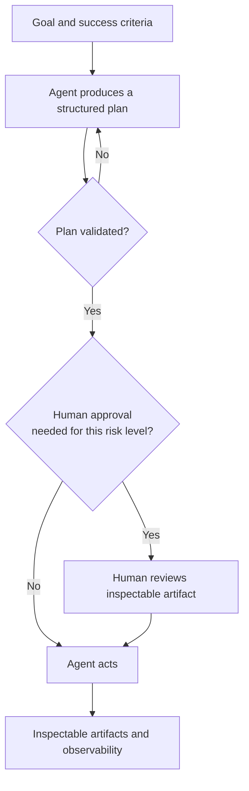
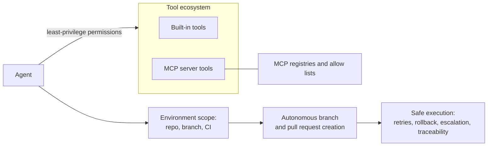
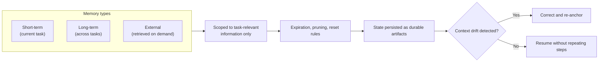
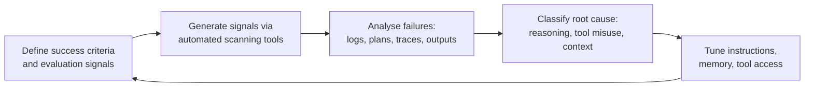
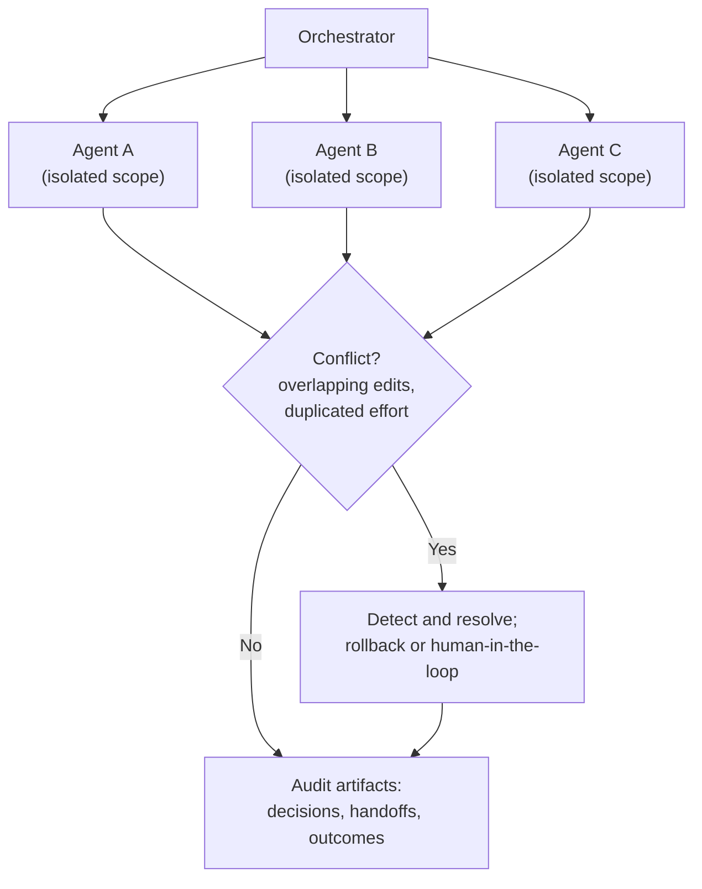
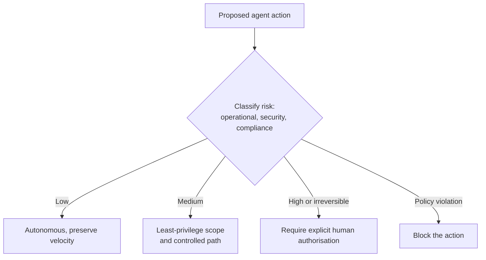
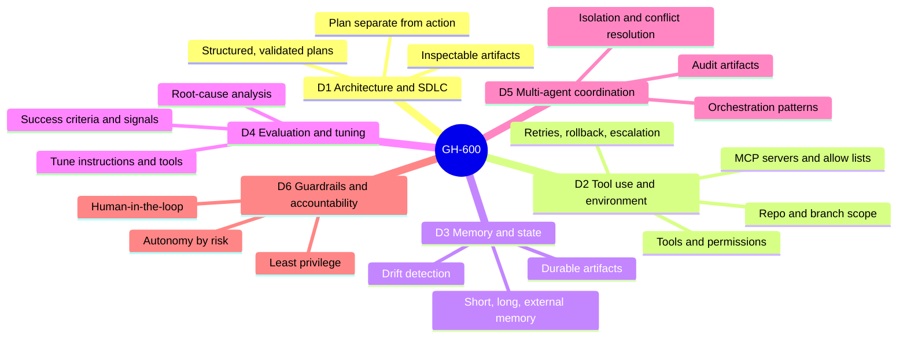

# Domain deep-dives

Each of the six domains is summarised below with the skills the study guide lists and a diagram that shows the flow. The weighting shows how many scored questions to expect, and therefore how much attention each domain earns in the sprint plan.

---

## Domain 1: Prepare agent architecture and SDLC processes (15-20%)

The foundation domain. It is about placing an agent correctly inside the software development lifecycle, and above all separating planning from action so a plan can be inspected and approved before anything happens.

Skills to master:

| Skill area | What it covers |
| --- | --- |
| Integrate agents into the SDLC | Identify the steps an agent performs, define inputs, outputs, and success criteria, and mitigate common anti-patterns |
| Separate planning from action | Configure planning distinct from execution, output a structured plan, validate plans, and block action until a plan is checked and approved |
| Observability and control | Set the degree of autonomy with guardrails, produce inspectable artifacts in standard tooling, and add human intervention that does not slow delivery |

---

## Domain 2: Implement tool use and environment interaction (20-25%)

The heaviest-scored domain. It covers giving an agent the right tools with the right permissions, wiring up MCP servers, scoping the agent to a repository and branch, and handling failure safely.

Skills to master:

| Skill area | What it covers |
| --- | --- |
| Select and configure tools | Identify required tools, configure them, and set tool permissions |
| Configure MCP servers | Add an MCP server as a tool, configure a GitHub remote MCP server, configure MCP registries, and manage allow lists |
| Integrate into dev environments | Scope to a repository and branch, invoke an agent in a CI workflow, and enable autonomous branch and pull request creation |
| Safe execution and error handling | Implement error handling, retries, rollbacks, escalation paths, and traceability for agent actions |

---

## Domain 3: Manage memory, state, and execution (10-15%)

How an agent remembers, what it persists, and how it avoids drifting off course during long runs.

Skills to master:

| Skill area | What it covers |
| --- | --- |
| Memory strategies | Choose between short-term, long-term, and external memory, and scope memory to task-relevant information with expiration, pruning, and reset rules |
| State and drift | Capture progress and decisions as durable artifacts, resume work without repeating steps, and detect and correct drift during long runs |
| Continuity across tools | Share state, and prevent conflicting or stale context across tools and environments |

---

## Domain 4: Perform evaluation, error analysis, and tuning (15-20%)

Deciding whether an agent did well, finding out why it failed, and adjusting it. This is the closest domain to product-manager instincts about measurement.

Skills to master:

| Skill area | What it covers |
| --- | --- |
| Success criteria and signals | Specify expected outcomes and constraints, identify qualitative and quantitative signals, and generate signals with automated scanning tools |
| Failure and root-cause analysis | Identify failures from logs, plans, traces, outputs, and workflow artifacts, then classify root causes |
| Tune behaviour | Revise instructions, workflows, or constraints, and refine memory and tool usage from evaluation results |

---

## Domain 5: Orchestrate multi-agent coordination (15-20%)

Running more than one agent at once without letting them collide, and keeping the whole workflow auditable.

Skills to master:

| Skill area | What it covers |
| --- | --- |
| Operate multi-agent workflows | Apply an orchestration pattern, isolate agents for parallel execution, and detect and resolve conflicts |
| Multi-agent observability | Produce review-and-audit artifacts, document decisions and handoffs, and perform post-hoc analysis |
| Failure response and lifecycle | Identify stalled or partial executions, apply recovery patterns, and add, update, or retire agents without disrupting active workflows |

---

## Domain 6: Implement guardrails and accountability (10-15%)

Deciding which agent actions need a human, and enforcing least privilege and explicit authorisation for anything irreversible.

Skills to master:

| Skill area | What it covers |
| --- | --- |
| Define autonomy levels | Classify actions by operational, security, and compliance risk, and assign autonomy levels that maximise speed while staying compliant |
| Guardrails and human-in-the-loop | Identify actions needing human judgment, block policy-violating actions, scope permissions to least privilege, and require authorisation for irreversible or compliance-sensitive changes |

---

## One picture for all six domains

