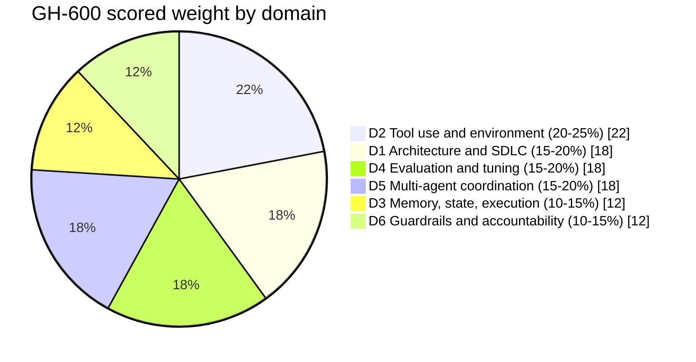
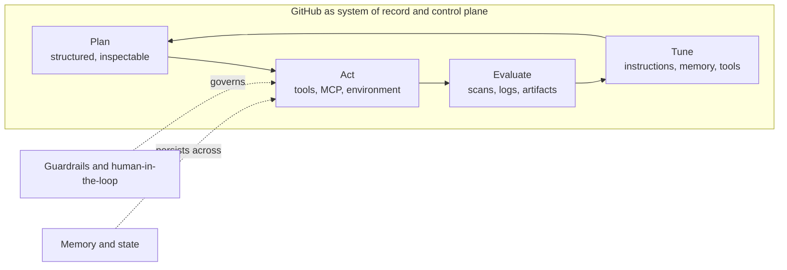

# GH-600: GitHub Certified Agentic AI Developer

A two-week, practice-first study kit for Exam GH-600, the exam behind the GitHub Certified: Agentic AI Developer credential. The kit is built for someone who already works with coding agents, custom instructions, MCP servers, and Copilot setup steps, and who wants to convert that hands-on experience into a passing score quickly.

## Exam facts at a glance

| Attribute | Detail |
| --- | --- |
| Exam code | GH-600 |
| Credential | GitHub Certified: Agentic AI Developer |
| Level | Intermediate |
| Maintained by | GitHub, delivered by Microsoft through Pearson VUE |
| Format | Proctored, may include interactive components |
| Duration | 120 minutes |
| Passing score | 700 (a score of 700 or greater passes) |
| Status | Generally available (not beta), so scores return immediately |
| Language | English |
| Scheduling | Personal Microsoft account (MSA) strongly recommended, so records survive a job change |

## What the exam measures

The exam is split into six domains. The percentages are the share of scored questions, which drives how the two-week plan allocates time.

The mental model that ties all six domains together is a single agent lifecycle running inside GitHub as the control plane.

Read the plan next, then work through the domain deep-dives.

## Pages in this kit

| Page | Purpose |
| --- | --- |
| [Two-week plan]({{ site.baseurl }}/gh-600-agentic-ai-developer/plan/) | Day-by-day sprint, weighted to the scored domains |
| [Domain deep-dives]({{ site.baseurl }}/gh-600-agentic-ai-developer/domains/) | Each of the six domains explained with a diagram and the key skills |
| [Resources]({{ site.baseurl }}/gh-600-agentic-ai-developer/resources/) | Official study guide, training modules, and supporting documentation |
