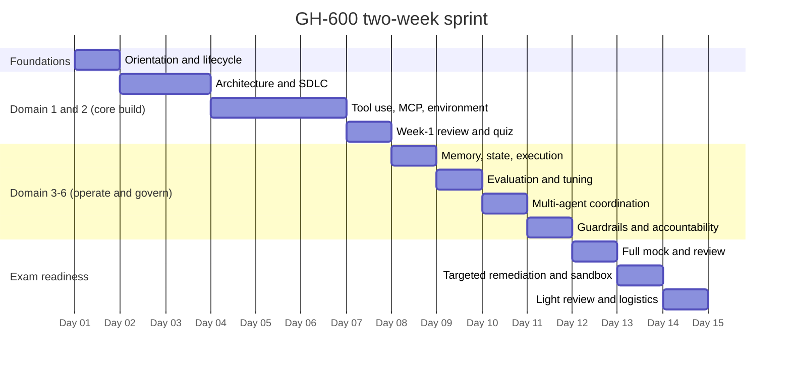
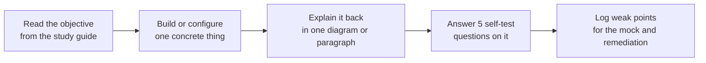

# Two-week sprint plan

Fourteen days, front-loaded onto the two heaviest-scored areas (tool use and the evaluation and coordination cluster), with the final three days reserved for mock exams and remediation. Each day assumes roughly two to three focused hours. Where a task can be built rather than read, the plan says build it.

## How the sprint is shaped

## Week one: build the mental model and the core skills

| Day | Focus | Do this | Anchor to existing work |
| --- | --- | --- | --- |
| 1 | Orientation and the agent lifecycle | Read the exam page and study guide end to end. Complete the *Foundations of Agentic AI in GitHub* module. Write the plan, act, evaluate loop from memory. Launch the exam sandbox to see the question interface. | The plan-act-evaluate loop is the same loop a custom agent already runs; name each phase against an agent that has been built before. |
| 2 | Domain 1: architecture and SDLC (part 1) | Study how agents integrate into the SDLC: defining inputs, outputs, and success criteria, and separating planning from execution. Practise writing a structured, inspectable plan an agent must output before acting. | Compare to writing a custom agent brief: goal, boundaries, and a plan gate before any file change. |
| 3 | Domain 1: architecture and SDLC (part 2) | Study observability and control for autonomous agents: autonomy levels, inspectable artifacts, and human intervention that does not slow delivery. Configure one agent to produce an inspectable artifact (a plan file or PR description) before it acts. | Map directly to copilot setup steps and custom instructions that force a plan before execution. |
| 4 | Domain 2: tool use (part 1) | Study selecting and configuring agent tools and, critically, tool permissions. List the tools an agent needs for a real task and scope each permission to least privilege. | Reuse a real skill or agent already built; write its tool and permission list as an exam-style answer. |
| 5 | Domain 2: MCP servers (part 2) | Study configuring MCP servers: adding an MCP server as a tool, configuring a GitHub remote MCP server, MCP registries, and allow lists. Build or configure one MCP server and attach it to an agent. | This is the strongest existing area; treat it as a review-and-formalise day rather than new learning. |
| 6 | Domain 2: environment and safe execution (part 3) | Study integrating agents into dev environments (repository scope, branch-based scope, CI invocation, autonomous branch and pull request creation) and safe execution paths: error handling, retries, rollbacks, escalation, traceability. | Connect to branch-scoped, PR-based agent workflows already in use; write the rollback and escalation path for one. |
| 7 | Consolidation | Re-draw the lifecycle diagram from memory with domains 1 and 2 annotated. Take a short self-quiz on domains 1 and 2. List every weak point for the week-two remediation day. | None; this is a synthesis day. |

## Week two: operate, govern, and get exam-ready

| Day | Focus | Do this | Anchor to existing work |
| --- | --- | --- | --- |
| 8 | Domain 3: memory, state, execution | Study short-term, long-term, and external memory; scoping memory to task-relevant information; expiration, pruning, and reset; persisting state as durable artifacts; detecting and correcting context drift. | Map to how a session or agent persists decisions as artifacts and resumes without repeating steps. |
| 9 | Domain 4: evaluation, error analysis, tuning | Study defining success criteria and evaluation signals, automated scanning tools, classifying root causes (reasoning errors, tool misuse, context or environment issues), and tuning instructions, memory, and tool access from results. | Map to a quality-scoring or evaluation habit already practised; frame it as evaluation signals. |
| 10 | Domain 5: multi-agent coordination | Study orchestration patterns, agent isolation for parallel execution, conflict detection (overlapping edits, duplicated effort, contradictory outputs), multi-agent observability and audit artifacts, and lifecycle management of agents in a workflow. | Map to orchestrator-and-subagent patterns; sketch a hub-and-spoke workflow for a real task. |
| 11 | Domain 6: guardrails and accountability | Study autonomy levels tied to risk, human-in-the-loop for high-judgment actions, blocking policy-violating actions, least-privilege scoping, and requiring explicit authorisation for irreversible changes. | Map to guardrail and permission patterns already used in agent configs. |
| 12 | Full mock exam | Sit a full-length, timed practice run under exam conditions. Score it, then bucket every miss by domain. Do not re-study yet; just diagnose. | None; this is a measurement day. |
| 13 | Targeted remediation | Re-study only the two lowest-scoring domains from day 12. Re-take the sandbox and any interactive question types. Re-draw the weakest domain diagram from memory. | None; remediation is driven by the mock result. |
| 14 | Light review and logistics | Skim all six domain summaries once. Confirm the personal MSA scheduling, legal name on the Learn profile, ID, and the online proctoring system pre-check. Rest. | None; readiness and logistics only. |

## Daily rhythm that keeps the sprint honest

The rule for the whole sprint: never finish a day on reading alone. Each domain objective should end in something built, drawn, or answered, because the exam rewards operating and governing agents, not reciting definitions.
