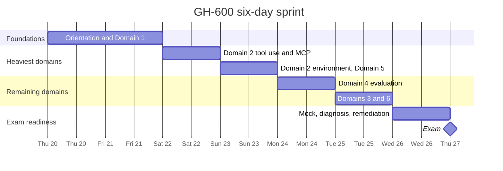
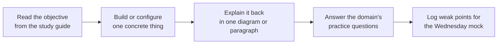

# Six-day sprint plan

A compressed plan for the run-up to an exam sitting on Thursday 27 August 2026,
covering the six and a half days from Thursday 20 August. It replaces the earlier
fourteen-day shape, which remains in the repository history for anyone working to
a longer runway.

The sequencing rule is simple: hours follow exam weight, and the heaviest domain
gets the largest uninterrupted block. Roughly thirty hours are available across
the window, which is sufficient provided the weekend and the final clear weekday
are protected.

## How the sprint is shaped

## Where the hours go

Time is allocated against the published domain weights rather than spread evenly.
Domain 2 carries the largest share of scored questions and receives roughly twelve
of the thirty available hours.

| Domain | Weight | Hours | Rationale |
| --- | --- | --- | --- |
| 2. Tool use and environment interaction | 20-25% | 12 | Heaviest scored domain, and the one closest to daily MCP and custom-agent practice |
| 5. Multi-agent coordination | 15-20% | 3 | Shares vocabulary with Domain 2, so it follows immediately |
| 4. Evaluation, error analysis, tuning | 15-20% | 3 | Conceptually closest to product measurement instincts |
| 1. Architecture and SDLC processes | 15-20% | 3 | Foundation for every other domain, so it comes early |
| 3. Memory, state, and execution | 10-15% | 1 | Lightest weight |
| 6. Guardrails and accountability | 10-15% | 1 | Lightest weight |
| Mock, diagnosis, remediation | n/a | 7 | The highest-value single block in the plan |

## The daily schedule

| Day | Hours | Focus | Output that closes the day |
| --- | --- | --- | --- |
| Thu 20 Aug, evening | 3 | Module *Foundations of Agentic AI in GitHub*. Read the study guide end to end. Launch the exam sandbox to see the question interface | The plan, act, evaluate loop drawn from memory |
| Fri 21 Aug | 2 | Domain 1 in full. Module *Designing Agent Architecture and SDLC Integration* | Every Domain 1 practice question answered |
| Sat 22 Aug | 6 | Domain 2, part one. Module *Tooling, MCP, and Agent Execution Environments*. Tool selection, tool permissions, MCP servers, registries, allow lists | One MCP server configured and attached to an agent |
| Sun 23 Aug | 6 | Domain 2, part two: repository and branch scope, CI invocation, autonomous branch and pull request creation, retries, rollback, escalation, traceability. Then Domain 5 | Domain 2 and Domain 5 practice questions answered |
| Mon 24 Aug, morning | 3 | Domain 4: success criteria, evaluation signals, automated scanning, and root-cause classification across reasoning errors, tool misuse, and context or environment issues | Domain 4 practice questions answered |
| Tue 25 Aug | 2 | Domain 3 memory and state, then Domain 6 guardrails and autonomy levels | Domain 3 and Domain 6 practice questions answered |
| Wed 26 Aug | Full day | Timed mock under exam conditions in the morning. Score it and bucket every miss by domain. Remediate only the two weakest domains in the afternoon. Re-run the sandbox | A scored mock and two remediated domains |
| Thu 27 Aug | Exam | Identity document ready and matching the Learn profile legal name. Online proctoring pre-check completed on the actual machine and network | |

## Three rules that matter more than the schedule

1. **Domain 2 is formalisation, not new learning.** MCP servers, custom agents,
   custom instructions, and setup steps are existing daily practice. The work on
   Saturday and Sunday is attaching exam vocabulary to familiar mechanics, which
   is faster than learning from cold.
2. **The Wednesday mock is not optional.** With six days there is no room to
   discover a weak domain during the exam itself. Diagnose first, remediate
   second, and resist re-studying before the mock is scored.
3. **No session ends on reading alone.** Each objective closes with something
   built, drawn, or answered, because the exam assesses operating and governing
   agents rather than reciting definitions.

## Daily rhythm

## Contingency if a day is lost

Should a scheduled block be lost, protect the order below and drop from the
bottom. The mock survives in every scenario, because an unmeasured gap is more
dangerous than an unstudied light domain.

1. Wednesday mock and remediation
2. Domain 2, both days
3. Domain 1
4. Domain 4 and Domain 5
5. Domain 3 and Domain 6
