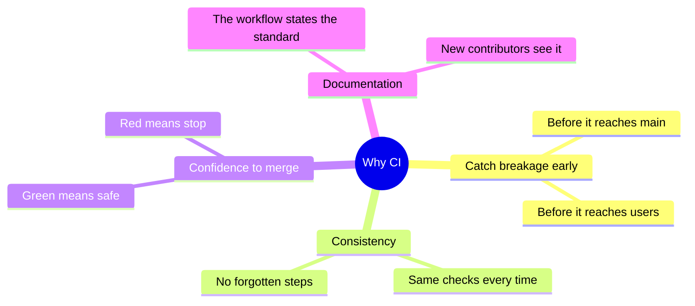
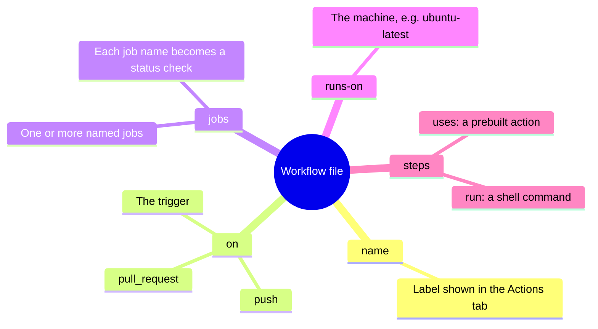
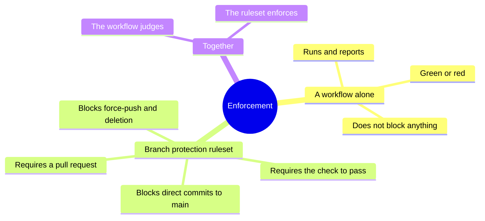
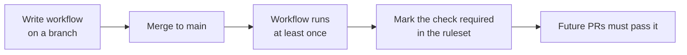

# CI workflows: why and how

Continuous integration (CI) is the practice of automatically checking code every time it changes, instead of hoping someone remembers to check it by hand. On GitHub, CI is expressed as a workflow: a small file that describes what to run and when. This page explains why CI is worth the effort, what a workflow file is made of, and how branch protection turns a workflow from a suggestion into an enforced gate.

## Why CI exists

Without CI, "does it still build?" and "did a secret leak into the code?" are questions answered by human memory. Memory fails. CI moves those checks to a machine that never forgets and runs them on every change.



The payoff is a simple signal on every proposed change: green means the automated checks passed, red means something needs attention before the change is allowed in.

## Two kinds of workflow, one repository

A common point of confusion is that a repository can have more than one workflow, and they serve different purposes. On a GitHub Pages site, for example, GitHub provides an invisible built-in workflow that publishes the site after a change reaches the main branch. A hand-written workflow can add a separate check that runs earlier, on the pull request, to catch a broken build before it is merged.

| | Built-in deploy workflow | Hand-written check workflow |
| --- | --- | --- |
| Who creates it | GitHub, automatically | The repository owner |
| Where it lives | Inside GitHub, no editable file | A `.yml` file in `.github/workflows/` |
| When it runs | After merge to main | On the pull request, before merge |
| Its job | Publish the result | Prove the change is safe to merge |

The lesson: the built-in workflow is the publisher, the hand-written one is the safety net. They complement each other.

## Anatomy of a workflow file

A workflow is a YAML file in `.github/workflows/`. It has a small number of parts, and once those parts are recognisable, any workflow becomes readable.



Here is a real, working example: a check that rebuilds a Jekyll site on every pull request, so a broken page is caught before merge.

```yaml
name: build

on:
  pull_request:
    branches: [main]
  push:
    branches: [main]

jobs:
  build:
    runs-on: ubuntu-latest
    steps:
      - name: Check out the repository
        uses: actions/checkout@v4

      - name: Build the Jekyll site
        uses: actions/jekyll-build-pages@v1
        with:
          source: ./
          destination: ./_site
```

Reading it part by part:

| Part | Value in the example | Meaning |
| --- | --- | --- |
| `name` | `build` | The workflow's label in the Actions tab |
| `on` | `pull_request`, `push` | Run on every PR into `main` and every push to `main` |
| `jobs` → `build` | one job named `build` | The unit of work; this name becomes the status check |
| `runs-on` | `ubuntu-latest` | A fresh Linux machine, discarded after the run |
| `steps` → `uses` | `checkout`, then `jekyll-build-pages` | Download the code, then rebuild the site to prove it still builds |

The distinction between `uses` and `run` is worth holding onto: `uses` pulls in a prebuilt action that someone else maintains, while `run` executes a raw shell command. Most steps are one or the other.

## From workflow to enforced gate: branch protection

A workflow on its own only reports a result. It does not stop anyone from merging a red change or committing straight past it. That enforcement is a separate feature: branch protection, configured as a ruleset on the repository.

The difference matters, and it is a frequent surprise: following a careful "always use a pull request" habit is a personal discipline, but only a ruleset makes GitHub actually refuse a direct commit to main.



A typical ruleset on a default branch combines four rules:

| Rule | What it enforces on `main` |
| --- | --- |
| Require a pull request | No direct commits; every change goes through a PR |
| Require status checks | A named check (such as `build`) must pass before merge |
| Block non-fast-forward | No force-pushes that rewrite shared history |
| Block deletion | The `main` branch cannot be deleted |

## One ordering trap to avoid

There is a sequencing rule that prevents a deadlock. A status check can only be marked "required" after its workflow already exists on the main branch. If a check is required before the workflow is merged, then every new pull request waits forever for a check that was never able to run on the branch it came from. The safe order is: merge the workflow to main first, confirm it has run at least once, then mark it required.



## Scope of protection: personal account versus organization

Branch protection is set per repository on a personal account. There is no account-wide switch that covers every personal repository at once. That account-wide layer exists only under a GitHub organization, where an organization-level ruleset can target many repositories by name pattern, and repository-level rulesets still layer on top. GitHub enforces the union of both, so the most restrictive rule wins. For a solo owner, the practical path is to apply the same repository ruleset to each repository, optionally scripted so it is one command per new repository rather than a manual walk through the interface each time.
