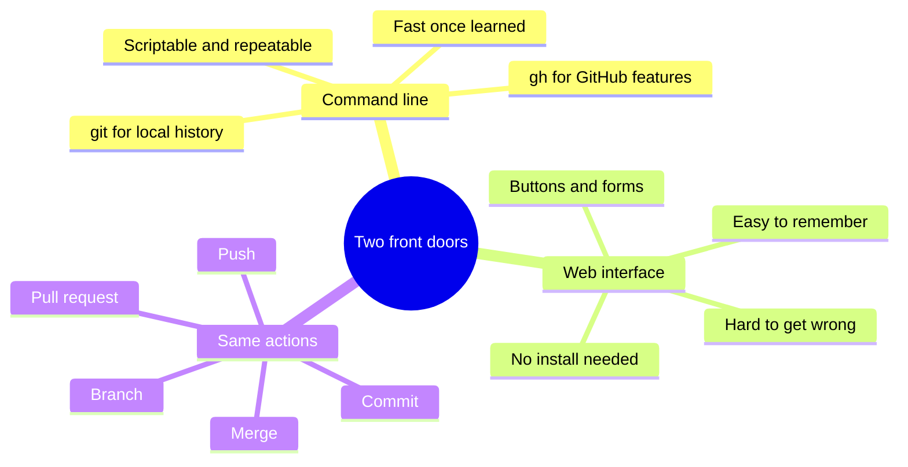
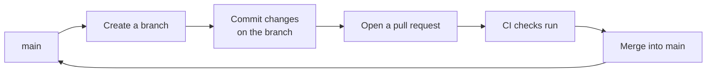

# Commands and their UI equivalents

Almost everything Git and GitHub can do has two front doors: a command typed in a terminal, and a click-path in the web interface. This page lists the core operations, pairs each command with the equivalent clicks, and states what the operation is for. The goal is not to memorise the commands but to recognise that a command and a button are often the same action wearing different clothes.

Two command families appear here. `git` is the version-control tool that runs on the local machine. `gh` is the GitHub command-line tool that talks to GitHub itself (pull requests, workflow runs, rulesets), things `git` alone does not know about.

## Starting and connecting a repository

| Operation | Command | Web interface | What it is for |
| --- | --- | --- | --- |
| Create a repository | `gh repo create name --public` | New → Repository, fill the form, Create | Make a new home for a project |
| Copy a repository locally | `git clone <url>` | Code → download or open in an editor | Get a working copy on the machine |
| Fork someone else's repo | `gh repo fork owner/name` | Fork button, top right of the repo | Make a personal copy that can be changed |
| See the remote address | `git remote -v` | Code button shows the URL | Confirm where pushes and pulls go |

## Making and saving changes

| Operation | Command | Web interface | What it is for |
| --- | --- | --- | --- |
| Check what changed | `git status` | The repo's file list shows edits on a branch | See what is modified before saving |
| Stage changes | `git add <file>` or `git add .` | Handled automatically when editing in the browser | Choose what goes into the next snapshot |
| Save a snapshot | `git commit -m "message"` | Commit changes button after an edit | Record a labelled point in history |
| Send commits to GitHub | `git push` | Automatic when committing in the browser | Publish local work to the remote |
| Bring down others' commits | `git pull` | Sync happens server-side; a local clone needs a pull | Update the local copy to match GitHub |

A commit is a labelled snapshot of the whole project at a moment in time. The message is not decoration; it is the note a future reader relies on to understand why the change was made.

## Branching and pull requests

Branching is the heart of safe collaboration: work happens on a side branch, and only reaches `main` through a reviewed pull request. This is the flow branch protection enforces.

| Operation | Command | Web interface | What it is for |
| --- | --- | --- | --- |
| Create a branch | `git checkout -b add-feature` | Branch dropdown, type a name, Create branch | Isolate a change from `main` |
| Switch branches | `git checkout main` | Branch dropdown, pick the branch | Move between lines of work |
| Open a pull request | `gh pr create --fill` | Contribute → Open pull request, or the prompt after a push | Propose merging a branch into `main` |
| List pull requests | `gh pr list` | Pull requests tab | See what is open |
| Merge a pull request | `gh pr merge --squash` | Merge pull request button on the PR | Bring the change into `main` after checks pass |
| Delete the merged branch | `git branch -d add-feature` | Delete branch button, offered after merge | Tidy up once the work is in |

A convenient property of the web editor: when a file is committed in the browser, GitHub offers to create a new branch and start a pull request in the same step. That single action replaces the branch, commit, push, and pull-request-open commands, which is why the interface is a good fit for anyone who would rather not memorise the sequence.

## Continuous integration and rulesets

These operations belong to `gh`, because they concern GitHub features rather than local history.

| Operation | Command | Web interface | What it is for |
| --- | --- | --- | --- |
| Create a workflow | Add a `.yml` file under `.github/workflows/` and commit it | Actions → New workflow → set up a workflow yourself | Define what CI runs and when |
| List workflow runs | `gh run list` | Actions tab, list of runs | See whether checks passed or failed |
| Watch a run's detail | `gh run view <id> --log` | Click a run in the Actions tab | Read the output when a check fails |
| Create a branch ruleset | `gh api repos/owner/name/rulesets --method POST --input file.json` | Settings → Rules → Rulesets → New ruleset | Enforce pull requests and required checks |
| Inspect rulesets | `gh api repos/owner/name/rulesets` | Settings → Rules → Rulesets | Confirm what protection is active |

## When to reach for which

Neither door is the right answer for every task. The interface wins for occasional, memorable actions and for anything where a mistake would be costly. The command line wins for anything repeated or scripted, and for operations the interface does not expose cleanly.

| Situation | Better door | Reason |
| --- | --- | --- |
| First time doing an operation | Web interface | Guided, hard to get wrong |
| Creating one workflow | Web interface | Editor plus branch-and-PR in one step |
| The same setup across many repos | Command line | One script beats repeated clicking |
| Reading why a check failed | Either | Both show the log; the command is faster |
| An operation the UI hides | Command line | `gh api` reaches features without a button |

The honest summary: learn the shape of each operation once, then use whichever door is in front of you. Recognising that `git commit` and the Commit changes button are the same act is worth more than memorising either one.
