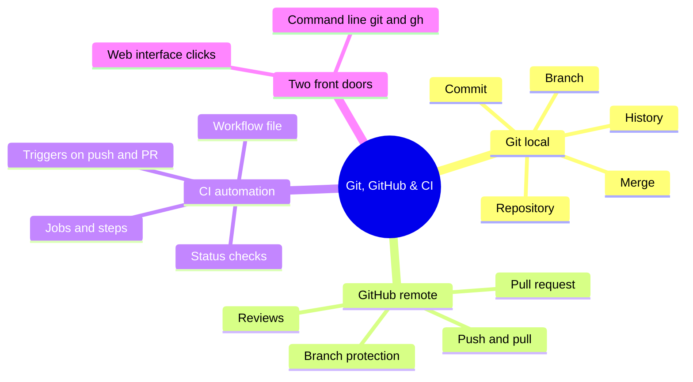
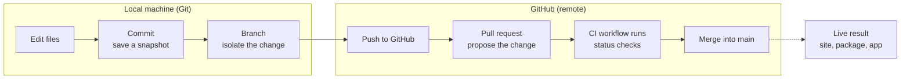

# Git, GitHub & CI

A practice-first kit for the plumbing that sits underneath every software project: version control with Git, collaboration and automation on GitHub, and continuous integration (CI) that checks work before it ships. The kit is written for someone who has mostly let a coding agent handle Git invisibly, and now wants to understand what is actually happening and be able to drive it, both from the command line and from the GitHub web interface.

Every concept in this kit is shown two ways: the command that does it, and the click-path that does the same thing in the browser. Neither is more correct. The command line is faster once memorised; the interface is easier to remember and hard to get wrong. A working practitioner moves between them.

## The whole landscape on one map

## How the pieces relate

Git is the engine that records history on a local machine. GitHub is a shared home for that history in the cloud, plus the collaboration features layered on top. CI is automation GitHub runs on the code whenever it changes. The three form a single flow: change code locally with Git, publish it to GitHub, and let CI verify it.

## Pages in this kit

| Page | Purpose |
| --- | --- |
| [CI workflows: why and how]({{ site.baseurl }}/git-github-ci/ci-workflows/) | What continuous integration is, why it matters, the anatomy of a workflow file, and how branch protection turns a workflow into an enforced gate |
| [Commands and their UI equivalents]({{ site.baseurl }}/git-github-ci/commands/) | The core Git and GitHub CLI commands, each paired with the click-path that does the same thing in the browser, and what each one is for |
